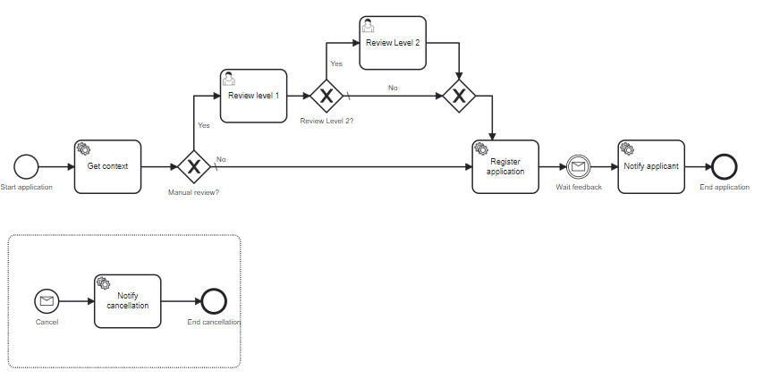

# process-execution-automator
Create scenarios to automate any execution of processes. Objectives are
A unit test,
load test,
CD/CI integration
The Automator does not start a Camunda Engine. It communicates with an external Camunda Engine and pilots the execution.

It can connect to a Camunda 7 or a Camunda 8 server.

# Execute a process
From a scenario, Automator calls the Camunda Engine server (C7 or C8) and executes the different steps in the scenario.
Let's take an example with this scenario:

A scenario is
create a new process instance with variable "subscriptionLevel: "GOLD", "customerId": 14422
The process is created and processed by the Camunda Engine. The GetContext operation is executed by the Camunda Engine, and, according to the information, the process instance moves to the task "Review Level 1"
in the scenario, Automator waits for this user task. It will execute it and set "ReviewLevel2Needed" to True.
The Camunda Engine move the process instance to Review Level 2.
In the scenario, Automator waits for this user task. It will execute it.
The Camunda engine continues the execution. It executes "Register Application", waits for the message, executes "Notify Applicant" and completes the process instance.

Another scenario can execute only "Review Level1" or no review at all.

What Automator do:
* it creates a process instance with some specific value
* it executes user tasks with some specific value
* it can throw a BPMN Message
Automator do not
* execute service task
* It is not expected to throw BMPN Message in the flow: a real system is piloted by the Automator.

* The goal of the Automator is not to simulate the execution, it is to pilot an execution on a real system, and to verify that the process reacts as expected.


# Requirement
Automator needs to connect to a running platform, Camunda 7 or Camunda 8.
Automator is not a process simulator. The running platform will execute all service tasks.

A scenario can be executed on a Camunda 7 or a Camunda 8 server.
Automator provides:
* a server running under Springboot
* a docker image
* an API to be integrated into any other tools

# Different usages

## Load test in the situation.

It is possible to start multiple instances on multiple Scenarios. For example, it is possible to say, "Start 2000 process instances with Scenario 1, 3000 instances with Scenario 2".
The platform will be overloaded, so it is possible to study if the configuration is acceptable.
This is not a performance test: the goal is not to generate all process instances as fast as possible but to simulate real usage.
It is possible in the scenario:
to specify a delay between each creation
to specify a delay in each user task, to simulate a real user
to determine the number of users per task, which execute the "Task refresh" action to simulate a pool of users

## Verification



in a CD/CI, you want to verify that a process follows the same behavior in the same performance time.
Running every day (or hours) or asking via an API call to replay a scenario is useful to verify there is no difference. If the customer is 4555, do we still move the process instance to Review Level 1"?
The second verification is the performance. The scenario can record an expected duration target (for example, 4 seconds to execute the Get Context service task. Does the execution still at this time?

## Coverage report

Execute multiple scenarios to be sure that all the process is covered correctly.
An "Execution round" is a set of scenarios executed at the same time. At the end of the execution, a coverage test can be performed.
A CD/CI verification may be to check the scenario execution, the target time, and the coverage.

## Advance process instance for development
During the development, you verify the task "Notify applicant". To test it in the situation, you must have a process instance in the process and pass four user tasks. Each test takes time: when you deploy a new process or want a new process instance, you need to execute again the different user task.
Using Automator with the correct scenario solves the issue. Deploy a new process, but instead of starting from the beginning of a new process instance, start it via Automator. The scenario will advance the process instance where you want it.

# Different BPM
The Automator executes a process instance. It does not care about the definition of the process: does the process instance call a sub-process? An Event sub-process? It does not matter.

## Call Activity and sub-process
Automator does not care about these artifacts. An execution is a suite of Activities. These activities are in the process, or a sub-process does not change the execution.

## User Multi-instance
A process can have a multi-instance task. In the scenario, each task may have multiple executions. It is possible to execute a multi-instance and give different values for each execution.

## External operation
A scenario may consist of executing some task and then sending a Cancellation message or starting a process instance in a different process to get a Cancellation message. This is possible to describe this operation in a step.


# Scenario
A scenario is a JSON file. A scenario explains one execution, from the process creation until a point. It may not be the end of the process: Automator can be used to advance process instances until a specific task.
It contains:
* Information on the process: which process has to start? Some information on a delay between two creations can be set
* Service task can be registered: Automator will check the process instance executes the task (but does not execute it)
* The end event can be registered to verify that the process goes to the end
The process instance can execute other tasks: Automator does not verify that, except if the "mode verification" is set to "Strict."

`````json


{
  "name" : "execution Round 14",
  "version": "1.2",
  "processId": "MergingInclusive",
  "executions": [
    {
      "name": "multinstance",
      "policy" : "STOPATFIRSTERROR",
      "numberProcessInstances": 100,
      "numberOfThreads": 5,
      "steps": [
        {
          "type" : "servicetask",
          "activityname": "Get context",
          "executiontargetms": 10000
        },
        {
          "type" : "usertask",
          "activityname": "Review level 1",
          "executiondelayms": 5000,
          "numberofexecution": 10,
          "taskvariable": {
            "statusreview": "YES"
          }
        },
        {
          "type" : "endevent",
          "activityname": "End application"
        }
      ]
    }
  ]
}
`````

## Execution parameters

| Parameter | Explanation                                                                                            | Example                         |
|-----------|--------------------------------------------------------------------------------------------------------|---------------------------------|
| Name      | Name of execution                                                                                      | "name": "This is the first run" |
| policy    | "STOPATFIRSTERROR" or "CONTINUE": in case of error, what is the next move. Default is STOPATFIRSTERROR | "policy": "STOPATFIRSTERROR"    |
| numberProcessInstances    | Number of process instance to create. Each process instance follows steps                              | "numberProcessInstances": 45    |
| numberOfThreads    | Number of thread to execute in parallel. Default is 1.                                                 | "numberOfThreads": 5            |

Then the execution contains a list of steps 


## STARTEVENT step

## USERTASK step

The step wait for a user task, and execute it.

| Parameter          | Explanation                                                                                                                              | Example                                                               |
|--------------------|------------------------------------------------------------------------------------------------------------------------------------------|-----------------------------------------------------------------------|
| type               | Specify the type                                                                                                                         | type: "USERTASK"                                                      |
| delay              | Deplay to wait before looking for the task, in ISO 8601                                                                                  | delay="PT0.1S" waits 100 ms                                           |
| waitingTime        | Wait maximum this time, before returning an error. Automator query the engine every 500 ms, until this delay. Default value is 5 minutes | waitingTime="PT10S"                                                   |
| activityId         | Activity ID to query                                                                                                                     | actiityId= "review"                                                   |
| variables          | List of variable (JSON file) to update                                                                                                   | {"amount": 450, "account": "myBankAccount", "colors": ["blue","red"]} |
| numberOfExecutions | Number of execution, the task may be multi instance. Default is 1                                                                        | numberOfExecutions = 3                                                |

# Build a Scenario
Automator can generate a scenario from a real execution.
The user creates a process instance and executes it. It executes user tasks until the end of the process instance or at a certain point.
Via the UI (or the API), the user gives the process instance. Automator queries Camunda Engine to collect the history of the process and, for each user task, which variable was provided. A new scenario is created from this example.

# Connect to a server
Automator does not contain any Camunda server. It connects to an existing Camunda Engine.
Two communication interfaces exist, one for Camunda 7 and one for Camunda 8. A scenario can then pilot a Camunda 7 or a Camunda 8 server.


# Comments
* embedded a Camunda 7
* start after an activity