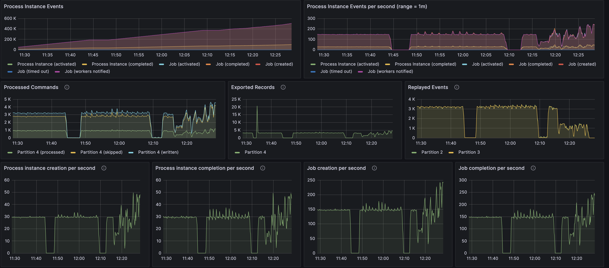
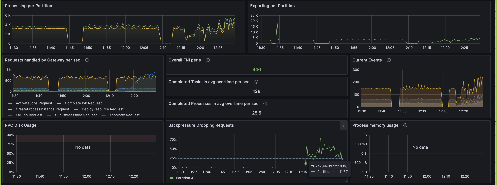

# How to conduct a load test

#  Introduction

Zeebe engine has different parameters that fit the performance.

* The number of partitions is a primary parameter.

Process instances are distributed against partitions.
The more partitions you have, the more cases you can handle simultaneously.
But, having too many partitions implied a delay in service tasks: to search for a job, they must address all partitions.

* The cluster size, which is the number of pods you created to host the Zeebe Engine
* The service task: How many workers do you need? More workers mean the throughput increases,
  but the network loads increase simultaneously on the ZeebeEngine and then on Zeebe.

* Data is exported in ElasticSearch and reindexed by Operate to display them.
  Multiple ElasticSearch and Operate pods may be needed.

The best way to find the correct configuration is to simulate the process load. The peak load must be used because changing the number of partitions is impossible. Then, downsizing the number of nodes (but not the partition/cluster size) is possible.

This is why identifying the goal is crucial.

# Identify the goal

The goal must be identified carefully to absorb the three next years, plus a margin.
Keep in mind that it is not possible at the moment to change the main parameters of a cluster (partitions, cluster size).
Refrain from overloading the goal: You may result in a large cluster, which is costly when unnecessary.

Let's take an example.

A system may peak at 18000 service tasks/ second for 30 minutes, but the average for the rest of the day is about 800 service tasks/second.

Does it make sense to configure the system to manage the peak or to absorb it in 2 or 3 hours?

For example, a cluster managing 1000 tasks/seconds. The number of extra tasks not handled by this cluster is

``` 
1800-1000*60*30=1,440,00 
```

How long will it take to absorb these tasks? A cluster able to manage 1000 service tasks per second leaves a bandwidth of 1000-800=200 tasks/second.

I am so, managing 1,440,000 (service tasks) /200 (service tasks/s)  / 60 (seconds/mn) = 120 minutes.

The cluster will be able to absorb the peak in 2 hours and will be 1800/1000 smaller.


## Number of process instances completed per period

The number of process instances created and executed for a period.

Example:
*   10000 process instances per day, in 20 hours, regularly

*   Or 4000 process instances per day, but the peak of absorbing is 120 process instances per second for a 2 hours duration

If the platform must absorb the peak, then the throughput at the peak is your goal.


## Latency

The latency is the time for one process instance to be completed. The goal may be to create and complete 120 process instances per second,
and 95% of the completion must be done in under 4 minutes.
A platform can face this throughput, but execution may take longer due to the batch mechanism. Respecting a high latency means, in general
increase the platform resource to ensure all execution runs as fast as possible.


## Replication factor

A replication factor determines the number of brokers that update in real-time. For example, with a replication factor of 3, 3 databases are updated in real-time.

According to the Raft protocol algorithm, the system continues to process if the quorum of the replica is reached. With a replication factor of 3,
```
quorum = 3/2 +1 = 2
```
So, if one broker dies, the system continues to work. If a second broker dies, data are safe, but the system will pause, waiting for a broker to restart.

Is this solution acceptable? To reduce the risk, multiple data centers can be used, and a broker can be placed on each one.
If a data center is down, it's acceptable.
The risk of having two data centers down simultaneously can be considered extremely rare and acceptable for a customer when another can decide not to take this risk.
Then, a replication factor of 5 may be better.

4 has no advantages: quorum if 4/2+1=3, so the system is paused if two brokers are down. With 5, quorum = 5/2+1=3, so two brokers can be down.
Using multiple regions and a replication factor of 3 can be reasonable, too. With 2 regions, this implies 2 brokers will be in the same region, so if this region dies, the cluster will pause.
To reach the quorum, a new broker can be started in the survivor region, or three areas can be used, with one broker in each region.

This strategy impacts performance. Communication between regions (or between data centers) is generally less performant.
This means a partition can handle only 120 service tasks per second, not 150. Thus, more partitions are needed to handle the throughput.

## Machine, memory

A Zeebe server is not very CPU—or memory-consuming, but this aspect must be taken into account in the load test.
The advice here is to target the maximum environment the customer can use to determine the platform. Then, if the platform is less used over time, it's possible to downsize it.


# Inputs

Inputs to simulate the Load are mandatory:

* the different processes running on the platform

* The Load on each process: how many process instances per period to create

* The path on each process: one process may have a decision gateway, and one path contains 3 service tasks, the second 20 service tasks. Does
  Does processes instance follow the 3 services task path? 20% on this path, 80% on the second one?

* Do you have an iteration? How many iterations on average?


* Data are essential. The more data you have, the more pressure you send to the Zeebe Engine to manipulate and store it.

* The service task and its execution time. This is important to determine the number of workers.
  For example, a task may be called 2000 times per minute, but its execution requires 1 minute.
  The workload is then 2000 * 1 mn every minute: 2000 pod workers are necessary (or 20 pod workers with 100 threads) to address that.
  The more pod workers in the platform, the more pressure you put on the Zeebe engine, and you may need more partitions to absorb this pressure.


With this information, a platform test can be set up, and a tool can load the platform. Service tasks can be simulated.


# Worker implementation

When you execute a service task, you can set up multiple threads and ask for various jobs.

Let's say you set up, for the service task "credit-charging", 3 threads and 3 jobs simultaneously. This service task takes 1 to 5 seconds to answer.

## Synchronous
In synchronous mode, the service task "handles" the call, and the execution is done using the handle method.
Doing that, Zeebe's client
•   Request 3 jobs
•   Send 3 jobs in 3 different threads (call handle() method)
•   Wait until the 3 jobs are finished to ask again for a new batch of 3 jobs.
If the execution varies between 1 and 5 seconds, it will wait for the most extended execution to ask again for the next job: it will wait 5 seconds. So, the pod may have a low CPU time execution.

Some threads will not be used when a new job is requested, so the worker does not work at 100% efficiency.
•   To have 100% efficiency, use only one thread.
•   Or request a batch higher than the number of threads: Thread 1 will pick up a new job when it finishes. The issue is still here at the end of the batch.

## Synchronous Thread (reactive programming)

A solution involves creating a new thread in the handle() method to realize the work. Then, all handle() methods were executed quickly, and Zeebe asked for a new batch.

https://blog.bernd-ruecker.com/writing-good-workers-for-camunda-cloud-61d322cad862

By doing that, there is no limitation if one job requires more time. The Java Client will immediately ask again for a new job with Zeebe.
Many threads are created, and the main issue is the overflow on the Java machine. If the management sends a request to an external service and has one thread to capture the answer, this is acceptable. However, if the management consists of executing a Java execution, this method can overflow the Java machine.
Synchronous Limited Thread
The idea is to control the number of threads that can be executed simultaneously to remove the main issue in the precedent implementation. The Concurrent Java class is used to manage a limited number of tokens. The handle() method must first get a token to create a new thread. It will wait if it can't get one, and the handle() method will be frozen. Then, the zeebeClient will stop to request a new job for Zeebe.

## Asynchronous call

The asynchronous call sends the complete() feedback before the worker executes it.
This implementation has this aspect:
•   The process execution is faster: the task is immediately released, and the process instance can advance to the next step, even if the treatment is not performed.
•   Because the feedback is sent before the treatment, returning any values is impossible. The process instance is already advanced, and it may be finished.
•   Does the treatment face an issue? Is it not possible to send an error or ask for a retry?
•   The treatment is immediately done, but the ZeebeClient will not ask for a new Job until all handle() methods are finished
The asynchronous call is an option for implementing a worker, but the number of concerns is significant, and this implementation is not recommended.

## Conclusion
The synchronous implementation is simple and should handle 80% of the use cases.
If the number of tasks to execute is essential, and the treatment may vary from one task to another, then the Synchronous Limited Thread is the best option. This implementation works even when treatment has the same time) increase the efficiency by 30%. Then, to handle a throughput, the number of pods to handle it can be reduced by 30%. The limited implementation is the best because the non-limited can arrive to have a pod with exhausted resources, and a local test can hide the issue if the number of tasks is not so significant.

# Tooling

It's essential to be able to run a load test on demand.
Your platform is up and running. You deployed the process on it. How do you run a load test?
Two tools exist:

## C8 Benchmak
This tool creates process instances on the flow and increases the frequency of creation: start creating 10 process instances per second, increase the frequency to 15, 2), and so on. The goal is to find the maximum Load the platform can handle at one moment and have performance reach a plateau. With this tool, you can simulate some service tasks, but the simulations are in "synchronous thread mode."

## Process Automator
This tool is used to make the load test as close as possible to reality. You create a scenario, asking to create 10 processes per second or with a different frequency, for example, 10 process instances per 15 minutes.
It can simulate the user, executing user tasks at a particular frequency.
There are different ways to simulate the service task: synchronously, using a synchronous thread, and using synchronous limited thread mode. Variables can be updated during the service task.
It is possible to execute multiple scenarios simultaneously to load various processes with different frequencies.
Last, the tool can simulate a platform: Do you want to set up 100 pods running the service task "credit-charging" and 200 pods running "customer-credit?" The tool accepts the configuration to execute this configuration. Then, you can see how Zeebe reacts when 300 pods request jobs via the gateway to size the gateway component correctly. In the same way, you can select the number of threads on each simulation service task.


# Principle
Change one parameter at a time. To see the impact of a change, changing multiple parameters between two executions can't help to understand the effect on one parameter.

Choose a reasonable time to run a test. Calculate the time to execute one process instance: for example, in addition to the time of all service tasks, a process instance needs 4 minutes.
This implies a warming up of 4 minutes minimum; adding 20% means 5 minutes.
With Zeebe, when a worker does not have anything to do, it will sleep a little before asking. This means that when tasks arrive, nothing may arrive before 10 or 20 seconds.
When multiple workers are on a service task, enough tasks must arrive to wake up all workers. This is why, during the warmup, the task thought increased slowly.
To measure the throughput, this warmup period must be over.

Using a too-long time is Counterproductive: you reduce the number of tests you can run.

In the end, when you fit the expected throughput, run an extended test (1 or 2 hours); some issues may be visible after some time. If the Operate's import does not follow the instructions, it's hard to detect it. If the cluster is built on some unstable performance resource, the issue may not be visible in a 10-minute test.

# Warmup
When a process instance is created, the Zeebe engine processes it. In general, the process has a service task.
100 process instances are created every 15 seconds. Then, 100 jobs are created.

A long pooling strategy is used to reduce the amount of communication between workers and the cluster. The worker contacts the cluster, and the request is handled if there is nothing to proceed. After a timeout, the cluster returns the answer to the worker; there is nothing to do.
Then, the worker used a back-off strategy. It makes no sense to ask immediately for jobs. The worker should sleep for a few seconds before asking.
On the second call, if there is still nothing to do, it waits double the time to wait before asking.

When jobs arrive, a job may need some time before a worker starts to get it.
It has multiple workers: the first batch may wake up only a few workers (the first one may capture the first 100 jobs).

A process may have multiple service tasks with the same strategy. The first instance may need 2 minutes to arrive at the end of the process, but when on Load, when all workers are up and running, only 20 seconds are required.

Here comes the goal: do you want to verify a complete load batch (for example, time to process 13000 process instances, wake-up included),
or a load, analyzing 10 minutes when the load period is more than 6 hours daily?

In the second go, it's important to wake up the process before analyzing the result. In our example, the first two minutes are not representative.

You can calculate the wake-up time or choose a metric (a process instance is completed, the curb of "complete process instance" starts, and arrive at a plateau)


# How to start

A technical estimation can be done to run a first load test.

A cluster has multiple parameters, and the main ones are
* The number of partitions
* the cluster size
* The replication factor

## replica factor
The replication factor comes directly from the goal. So, fix it and forget it.

## cluster size
The cluster size is the number of brokers, i.e., the number of pods in the cluster.

The primary advice on the `cluster size` is to link it to the `partition number`. Why?

The number of partitions determines the number of Leaders. Followers are the replica factor -1.
If the cluster size = number of partitions, then there is one Leader on each broker.
Of course, this may change: a broker can die, and then a Leader is elected, which means one broker will host two leaders at this moment.
But this is not the primary behavior, and the cluster will be in a downgrading mode so that performance may be slower.
If this is not acceptable, the cluster size can be more than the number of partitions, but even with that, you don't know for sure that a broker does not host two Leaders.
If you want this actuality, you must set
```
cluster size=number of partitions * replication factor
```

Having cluster size > number of partitions means you will have a broker-only follower(s).
In the execution, the follower only records the Leader (saves the data), which does not consume a lot of CPU.
In terms of throughput, this situation will reduce the CPU on the Leader broker (there will be one less follower) and cause some pods to be underused.

Having cluster size < number of partitions means one broker hosts multiple leaders. Some pods may use more CPU and react slower than others.
This may cause a heterogeneous cluster, which may affect the result.

Considering linking the cluster size to the number of partitions is more reliable because the system is homogeneous. Adding then a partition is more predictable.

## number of partitions

This is the main parameter to play with.
How do you estimate the first number of partitions?

According to the Saas estimation, a cluster can handle 500 service tasks/ seconds.
See https://docs.camunda.io/docs/components/best-practices/architecture/sizing-your-environment/#camunda-8-saas

This means a partition can handle
```
500/3=166 service tasks per second
```

This approach implies estimating the number of service tasks per second.
To do that, start from the goal of process instances, look into processes to estimate the path, and determine the number of service tasks per process instance. Consider sending a message as a service task.

Attention: This is an estimation to start with. Of course, a process instance with a large payload will require more partitions to handle the required throughput.
Processes with a lot of gateway and loops with multiple instances have an impact, too.

Starting with this method, give a first estimation.

Then, estimate the number of workers you need for each service task. A worker can handle 250 threads. Then, 1 partition for every 5 workers will be added.

Multiple other factors will impact the number of partitions, such as latency between regions for various regions, latency between data centers, disk speed, and elastic search throughput.


## Identify the number of workers

IdentifyingIdentifying the number of workers for a service task takes work.
For example, let's say a service task needs 8 seconds to execute a task.
If you have a throughput of 1 service task per minute, one thread can handle this throughput.

But if there is a throughput of 10 service tasks every minute, more than 1 thread is needed: one thread can handle 60/8=7.5 tasks per minute.
And what about if the requirement is 750 service tasks per second?

The simple way to calculate the number of workers is to calculate
* The Capacity for one thread. The Capacity is how many tasks a thread can handle on a period
* the Load. The Load is how many tasks can be performed in a period

First, fix the "period of time." To make the calculation simple, use the unit of time to execute a task. If a task is running in 12 seconds, choose the minute.
If a task is running in milliseconds, choose the second.

Let's choose the minute.
The Capacity is the number of tasks a thread can run in a minute.

A service task needs 8 seconds. So, the Capacity is

````
Capacity/mn = 60 s / 8 s = 7.5
````

Each minute, a thread worker can run 7.5 tasks.


The Load depends on the number of tasks to be executed in the same period (the minute)
The requirement is 750 task/s
````
Load/mn = 750 task/s * 60 = 45,000
````
How many thread workers do we need?

````
Nb Thread worker = <Load>/Capacity> = 45,000/7.5 = 6,000
````


In Camunda 8, a worker can handle multiple threads. The type and implementation of the worker depend on each other.
If the worker needs 8 seconds and consults the CPU during these 8 seconds (it merges images in a PDF), a worker can handle 10 to 50 threads.
If the worker calls an external service using the reactive programming or thread pattern, it may handle 200 or 1000 threads, maybe more.

If the worker uses the classical pattern and it's acceptable from the CPU point of view, a worker can host 200 to 250 threads. After the Java machine and the Zeebe client manage a lot of threads, performance decreases.
6,000/2,50=24 pods may be necessary for the simulation.


# Understand the main concept

With Zeebe, a partition is a complete server. So, adding a partition increases the throughput, But different factor comes:
* adding partitions increases the work for the zeebe gateway to search for jobs for workers. Maybe this must be added
* Adding partitions implies to add a pod. Does the physical node can handle that? Is a node necessary?

Adding partition is maybe not the solution: may a worker be underestimated, and the throughput is not reached because there are a lot of jobs waiting in a task?

Monitoring the cluster during the load test and detecting any suspended jobs is also mandatory.

During the load test, these metrics must be checked.

## Partitions
A partition is a logical server. When a process instance is created, the Zeebe Gateway chooses a partition.
Then, all operations will be redirected to this partition. A second partition doubles the cluster's Capacity.
This is why partitions are one of the main parameters that must be played out.

## Backpressure
Process instances are created. Workers query the cluster to get jobs to execute. Jobs are executed, and workers connect the cluster again to send the result.
Partitions handle these requests, but there may be too many requests to proceed.
This may arrive if there is too much creation or an execution needs time: a multi-instance, with 1000 instances to create, requires some milliseconds or seconds for the engine to proceed.

When a partition receives too many requests, it will reject them. This is the back pressure.
Having some back pressure from time to time is acceptable. Zeebe client manages that a process instance creation order will be retried. A worker will delay the request to get new jobs.
However, having more than 1 % on a partition is counterproductive: more requests are sent (because the client will retry), which indicates that the cluster can't handle the throughput.


## Worker – synchronous or asynchronous

Workers can be implemented in multiple ways. The principal impact on the cluster is on how the cluster accepts jobs.

Let's take a worker with a method handle like this:
```
handle()
{
  // do the job
  jobs.complete().send().join()
}
```

This implementation will execute the job, send the answer, and wait for the status.
Then, and only after the answer, will the thread return to the Zeebe client library. The library will then ask for new jobs, whether immediately or not.

If a number of jobs is asked during the subscription (for example, 20), then the library collects 20 jobs (or less) and starts 20 threads. But it will wait until 70% of these jobs are finished to ask for a new batch.

This method is excellent when the worker is not under pressure. But then different methods to improve the speed are possible
Some are
* do not join() the complete: the worker does not wait for the answer. If you need to log the result, use method ".exceptional()" or ".result()": your code will be called, but not in that thread
* use the "streamEnabled(true)" parameters: the library will not wait that 70% of the batch is finished to get a new job.
* use the reactive programming method. Then, in the "execute()", a thread is created, or a request is sent, and the result will be managed in a new thread, but the current thread is returned, and new jobs can be accepted


Visit "writing good worker" and "C8 implementation" documentation.

## Flows: Zeebe, Exporter, Reindex

The flow is the following on the creation of a process instance:
* an application asks to create a process instance; it connects the Zeebe Gateway, which chooses a partition, and then connects the Leader of the partition
* the Leader registers the order in the stream, sends the information to followers, and waits for the acknowledge
* When the Leader gets the acknowledgment, it executes the order (creates the process instance), returns the information to the client, and sends the status to followers
* when followers returned a status pointer in the stream advance
* a second pointer in the stream exports data to Elastic search in raw data
* Operate monitor the Elastic Raw Data, and import it in the Operate indexes
* TaskList and optimize do the same.

One simple order goes to multiple components until they are visible in Operate. During a load test, all these components are under pressure.

To execute a service task, the operation is different
* a worker connects the Zeebe Gateway to get jobs related to a topic
* The zeebe gateway contacts all partitions to collect jobs
* each partition registers the lock (workerId W3453 lock the jobId 9989). Then, it replicates the information to its follower
* Zeebe gateway returns the list to the worker

When the worker executes a job
* Zeebe gateway sends the status to the partition
* the partition contacts its follower to register the result
* then, the partition returns the information to the worker
* This information is exported to Elastic Search and will be imported by Operate/TaskList/Optimize


# Check metrics
During the load test, the Grafana page and Operate are the primary information to consider.


## Check the throughput
Four throughputs must be checked:

**Creation of process instance**
Does the tooling create enough process instances? If not, the tool must be checked. The cluster may be the issue if the tool is not the issue. No partition must be added to face the throughput. Check the back pressure, the GRPC latency

**Process completion**
This is the main parameter directly related to the goal. Check the other parameter if it is lower than the expected goal.
In general, this curb starts after the creation of a process instance: if a process instance needs at least 1 minute to complete, then this curb will have a minimum one-minute delay.
See the warmup strategy.

**Jobs creation**
This is an essential factor. If the job creation is insufficient, the goal can't be reached.

**Jobs completion**
This is the first metric to complete. If the level does not reach the goal, it may be due to multiple factors. See the action/reaction section.

## CPU/memory on different pod
Check the CPU on each component. If the element is overflow, add more resources.


## GRPC latency

The different GRPC latencies are important to check
**Creation**
The creation must be as smooth as possible. The correct time to create a process instance should stay under 50 ms. The target is a 10 ms bucket.

**get jobs**
Zeebe handles a get jobs call via a long pooling method when there is nothing to do. Requests in the "infinite" level are normal. This is the sign that you have workers waiting for jobs.
On the opposite, the main request must be under 50 ms.
Having requests in the range of 500 ms-10 seconds is not a good situation: there are jobs, but it takes time for the worker to catch them.

**Complete job**
A worker completes a job and sends the request to the cluster. Like the instance creation process, the answer must be as fast as possible.

## Elastic search exporter

This metric is important because it's a vicious situation.
Zeebe has a two-pointer in the stream
* one to follow the execution
* and one to follow the exporter to Elastic Search.

The Zeebe cluster can be correctly sized to handle the whole, but the two pointers will diverge if the Elastic search needs to be faster.
The stream is saved in memory and on disk. The stream grows, and at one moment, when the disk is entire, zeebe will pause the execution.
Backpressure will be visible, and the throughput will be the Elastic search throughout.
The difficulty here is that the situation will be visible only when the disk is complete.

The Elastic search pointer is behind: Zeebe writes records per batch rather than record per record to be more efficient. However, the difference must be manageable and manageable.
To check that, verify the position of the Zeebe pointer and the Elastic search exporter. The Elastic search exporter must be behind by 800 or 1000 positions, and the difference must be stable,


Note: It is acceptable if the cluster faces a peak, and the disk will absorb the situation.


## Operate
Via Operate, check the number of jobs per task. If the number of workers is underestimated, a service task will make the number of functions too essential.
This may be related to the GRPC latency (there are enough workers, but the completion is too long) or insufficient workers to handle the throughput.

The second effect is the operating importer.
Zeebe exports data in a Raw index, and then Operate imports the data in the Operate index.
If the importer is behind, Operate will show the situation from the past.
The simple way to detect the situation is at the end of the load test. Stop creations and workers: now, zeebe, finish work.
During one minute, information in Operate should change (the importer finishes importing the last information), but if the data still changes after this time, operate importer is too slow and must be scaled.


# Action-Reaction

## No back pressure, but throughput is lower than expected

## Backpressure
A back pressure means a partition receives too many requests to handle.
It may be due to
* there is too much request
* Leaders take time to contact followers, especially when followers are in a different region
* disk is too slow (check the IO metrics)
* Elastic search exporter is too slow (check the exporter pointer)

A simple solution is to increase the number of partitions. If you have a 5% backpressure, start by adding 5% more partitions.


## Platform is not stable

The throughput of the GRPC is not stable.






It may come from multiple factors.
* The disk throughput is not stable. It's typical with a NFS disk
* Check the infrastructure: CPU, Memory, network
* search what changed at this moment: new process instance started? More workers?

## Low GRPC throughput

The GRPC latency is high for complete jobs. Partitions get a lot of operations to perform.


Increase the number of partitions to share the Load.

## Low creation of process instance
The throughput of the creation is behind the expected one.
Zeebe does a speedy job on the creation, reaching 1000 PI/second quickly.

Check the tool that creates the process instances or increases the number of partitions. Also, check the GRPC latency during creation.

## Operate is behind the reality
At the end of a load test, stop the creation and workers.
Check the value in operation. After one minute, does the value still change?

If yes, the Operate import is behind and needs to be scaled.