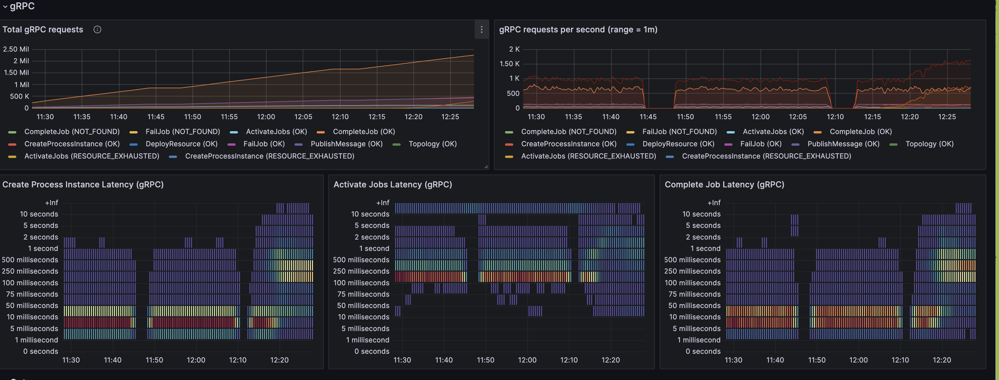

# How to conduct a load test

#  Introduction

Zeebe engine has different parameters to fit the performance.

* The number of partitions is a primary parameter. 

Process instances are distributed against partitions. 
The more partitions you have, the more cases you can handle simultaneously. 
But, having too many partitions implied a delay in service tasks: to search for a job, they must address all partitions.

* The cluster size, which is the number of pods you created to host the Zeebe Engine
* The service task: How many workers do you need? More workers mean the throughput increases, 
but the network loads increase simultaneously on the ZeebeEngine and then on Zeebe.

* Data is exported in ElasticSearch and reindexed by Operate to display them. 
Multiple ElasticSearch and Operate pods may be needed.

The best way to find the correct configuration is to simulate the process load. The peak load must be used because changing the number of partitions is impossible. Then, downsizing the number of nodes (but not the partition/cluster size) is possible.

This is why identifying the goal is crucial.

# Identify the goal

The goal must be identified carefully to absorb the three next years, plus a margin. 
Keep in mind this is not possible at the moment to change the main parameters of a cluster (partitions, cluster size).
Do not overload the goal: you may result in a large cluster, costly, when actually it is not necessary.

Let's take an example.

A system may have a peak of 18000 services tasks/ second for 30 min, when the average the rest of the day is about 800 services tasks/seconds. 

Does it make sense to configure the system to manage the peak, or to absorb it in 2 or 3 hours?
 
For example, a cluster managing 1000 tasks/seconds. The number of extra task not managing by this cluster is

``` 
1800-1000*60*30=1,440,00 
```

How long it will take to absorb these tasks? a cluster able to manage 1000 services task per second leave a bandwidth of 1000-800=200 tasks/second.

So, managing 1,440,000 (service tasks) /200 (service tasks/s)  / 60 (seconds/mn) = 120 minutes.

The cluster will be able to absord the peak in 2 hours. And it will be 1800/1000 smaller.


## Number of process instances completed per period

The number of process instance created and executed for a period.

Example:
* 	10000 process instances per day, in 20 hours, regularly

*	Or 4000 process instances per day, but the peak to absorb is 120 process instances per second for a 2 hours durations

if the platform must absobe the peak, then the throughput in the peak is your goal.


## Latency

The latency is the time for one process instance to be completed. The goal maybe to create and complete 120 process instances per seconds, 
and 95% of the completion must be done under 4 minutes.
A platform can face this throughput but execution may take more time, due to the batch mechanism. Respecting a hight latency means in general 
increase the platform ressource, to ensure all execution run as fast as possible.


## Replication factor

A replication factor determin the number of broker update in real time. With a replication factor = 3, 3 database are updated in real time.

According to the Raft protocol algorithm, the system continue to process if the quorum of replica is reach. With a replication factor to 3, 
```
quorum = 3/2 +1 = 2
```
So, if one broker die, the system continue to work. If a second broker die, data are safe, but the system will pause, waiting for a broker to restart.

If this solution is acceptable? To reduce the risk, miultiple data center can be used, and a broker place on each datacenter.
If a data center is down, it's acceptable.
The risk to have two data center down at the same time can be considered as extremery rare, and acceptable for a customer, when an another can decide to not take this risk.
Then, a replication factor of 5 may be better.

4 does not have any advantages: quorum if 4/2+1=3, so if two broker are down, system is pause. With 5, quorum = 5/2+1=3, so two broker can be down.
Using multiple region and replication factor = 3 can be reasonnable too. With 2 regions, this implie 2 brokers will be on the same region, so if this region die, cluster is pause.
A new broker can be start in the survivor region to reach the quorum, or 3 regions can be used, one broker in eqch region.

This strategy has an impact on the performance. In general, communication between regions (or between data center) are less performant.
This means a partition can handle not 150 services task per second, but maybe only 120. Then, to handle the throughput, more partitions is needed.

## Machine, memory

A Zeebe server is not very consumming in CPU, or in memory, but this aspect must be take into account in the load test.
The adivce here is to target the maximum environment the customer can use to determine the platform. Then, if the platform is less used in some period of time, it's possible to downsize it.


# Inputs

Inputs to simulate the load are mandatory:

* the different processes running on the platform

* The load on each process: how many process instances per period of time to create

* Data are essential, mainly if the process contains multi-instance tasks (one process instance may generate 100 service tasks)

* The service task and the execution time for each service task. This is important to size the number of workers.
For example, a task may be called 2000 times per minute, but its execution requires 1 minute. 
The workload is then 2000 * 1 mn every minute: 2000 pods worker are necessary (or 20 pods worker with 100 threads) to address that.
More pod worker you have in the platform, more pressure you put ohn the Zeebe engine, and you may need more partitions to absorbe this pressure.


With this information, a platform test can be set up, and a tool can load the platform. Service tasks can be simulated. 


# Worker implementation


5.1	Synchronous, Synchronous thread, synchronous limited thread, asynchronous
Synchronous, Synchronous thread, synchronous limited thread, asynchronous
When you execute a service task, you can set up multiple threads and ask in one-time multiple jobs.
Let’s say you set up, for the service task “credit-charging”, 3 threads and 3 jobs at each time. This service task takes 1 to 5 seconds to answer.
Synchronous
In the synchronous mode, the service task “handles” the call, and the execution is in the handle method.
Doing that, Zeebe's client
•	Request 3 jobs
•	Send 3 jobs in 3 different threads (call handle() method)
•	Wait until the 3 jobs are finished to ask again for a new batch of 3 jobs.
If the execution varies between 1 to 5 seconds, it will wait for the longest execution to ask again for the next job: it will wait 5 seconds. So, the pod may have a low CPU time execution.

Some threads will not be used when a new job is requested. So, the worker does not work with a 100%efficiency.
•	To have 100% efficiency, use only one thread.
•	Or request a batch higher than the number of threads: Thread 1 will pick up a new job when it finishes. The issue is still here at the end of the batch.
Synchronous Thread
A solution consists of creating a new thread in the handle() method to realize the work. Then, all handle() methods were executed very fast, and Zeebe asked for a new batch.

Doing that, there is no more limitation if one job needs more time. The Java Client will immediately ask again for a new job with Zeebe.
A lot of threads are created, and the main issue is the overflow on the Java machine. If the management consists of sending a request to an external service and having one thread to capture the answer, this is acceptable. But if the management consists of executing a Java execution, this method can overflow the Java machine.
Synchronous Limited Thread
To remove the main issue in the precedent implementation, the idea is to control the number of threads that can be executed at a time. The Concurrent Java class is used to manage a limited number of tokens. To create a new thread, the handle() method must first get a token. If it can’t get one, it will wait, and the handle() method is frozen. Then, the zeebeClient will stop to request a new job for Zeebe.

Asynchronous call
The asynchronous call consists of sending the complete() feedback before the execution of the worker. This implementation has this aspect:
•	The process execution is faster: the task is immediately released, and the process instance can advance to the next step, even if the treatment is not performed.
•	Because the feedback is sent before the treatment, it is not possible to return any values. The process instance is already advanced, and it may be finished.
•	Does the treatment face an issue, is it not possible to send an error or ask for a retry?
•	The treatment is immediately done, but the ZeebeClient will not ask for a new Job until all handle() methods are finished
The Asynchronous call is an option to implement a worker, but the number of concerns is very important, and this implementation is not recommended.
Conclusion
The synchronous implementation is simple and should handle 80% of the use cases.
If the number of tasks to execute is important, and the treatment may vary from one task to another, then the Synchronous Limited Thread is the best option. This implementation works even when treatment has the same time) increase the efficiency by 30%. Then, to handle a throughput, the number of pods to handle it can be reduced by 30% The limited implementation is the best because the non-limited can arrive to have a pod with exhausted resources, and a local test can hide the issue is the number of tasks is not so important.

# Tooling

it's important to be able to run a load test on demand.
Your platform is up and running. You deployed the process on the platform. How to run a load test?
Two tools exist:
C8 Benchmak
This tool creates process instance on the flow, and will increase the frequency of creation: start creating 10 process instance per seconds, and increase the frequency to 15, 2) and so on. The goal is to find the maximum load the platform can handle at one moment, performance reach a plateau. With this tool, you can simulate some service tasks, but the simulation are in “synchronous thread mode”
Process Automator
This tool is used to stick the load test as close as possible of the reality. You create a scenario, asking to create 10 process per seconds, or with a different frequency, for example 10 process instance per 15 minutes.
It can simulate user, executing user task at a certain frequency.
It has different way to simulate the service task: synchronously, synchronous thread and synchronous limited thread mode. It is possible to update variable during the service task.
It is possible to execute at the same time multiple scenarios, to load multiple processes with different frequency.
Lest but not the least, the tool can simulate a platform: you want to setup 100 pods running the service task “credit-charging” and then 200 pods running “customer-credit”? The tool accepts the configuration to execute this configuration. Then, you can see how Zeebe react when 300 pods request jobs via the gateway, to size correctly the gateway component. In the same way, you can select the number of threads on each simulation service tasks.


# Principle
Change one parameter at a time. To see the impact of a change, changing multiple parameters between two executions can't help to understand the impact on one parameter.

Choose a raisonable time to run a test. Calculate the time to execute one process instance: for example, additionning the time of all service task, a process instance needs 4 minutes.
This implie a warming up of 4 minutes minimum, adding 20% means 5 minutes.
With Zeebe, when a worker does not have anything to do, it will sleep a little before askeing. This means, when a tasks arrived, nothing may arrive before 10 or 20 seconds. 
When there is multiple workers on a service task, this means enought tasks must arrive to wake up all workers. This is why during the warmup, the task thougput inrease slowly. 
To mesure the througput, this warmup period must be over.

using a too long time is Counterproductive: you reduce the number of test you can run.

At the end, when you fit the expected thorugput, run a long test (1 or 2 hours): some issue may be visible after a period of time. if the operate import does not follow the thougout, it's hard to detect it. if the cluster is build on some instable performance ressource, the issue may not be visible in a 10 minutes test.

# Warmup
When a process instance is created, the Zeebe engine process it. In general, there is a service task in the process.
Let's say 100 process instance are created every 15 seconds. Then, 100 jobs are created.

In order to reduce the number of communication between workers and cluster, a long pooling strategy is used. The worker contact the cluster, and if there is nothing to proceed, handle the request. After a timeout, cluster send back the answer to the worker; nothing to do.
Then, the worker used a backoff strategy. It make no sense to ask immediately for jobs. Worker sleep some few second before asking.
on the second call, if there is still nothing to do, it wait double the time to wait before asking.

Saying that, when a jobs arrived, it may need some time before a worker start to get it.
And it have multiple workers: the first batch may wakeup only few workers (the first one capture the first 100 jobs).

A process may have multiple service tasks, with the same strategy. To arrive at the end of the process, first instance may need 2 minutes, when on load, when all workers are up and running, only 20 seconds is needed.

Here come the goal: do you want to verify a complete load batch (for example, time to process 13000 process instance, wakeup included), 
or a load, analysing 10 minutes when the load period is more than 6 hours per day?

In the second goq, it's important to wake up the process before analised the result. In our example, the 2 first minutes are not representative.

You can calculate the wakeup time, or choose a metric (a process instance is completed, the curb of "complete process instance" starts, and arrive to a plateau)


# How to start

To run a firstload test, a technical estimation can be done.

A cluster has multiple parameters, and the main are
* the number of partitions
* the cluster size
* the replication factor

## replica factor
The replication factor comes directly from the goal. So, fix it and forget it.

## cluster size
The cluster size is the number of broker, i.e. the number of pods in the cluster.

The main advice on the cluster size is to link it to the number of partition. Why?

The number of parition determine the number of Leader. Followers are the replica factor -1.
If the cluster size = number of partition, then there is one Leader on each broker. 
This may change of course: a broker can die, then a Leader is elected, which mean one broker will host two leaders at this moment.
But this is not the main behavior, and the cluster will be in a downggrading mode, performance may be slower.
If this is not acceptable, then the cluster size can be more than the number of partition, but even that, you don't have the certitude that a broker does not host two Leaders
If you want this certifitude, you must set 
```
cluster size=number of partitions * replication factor
```

Having cluster size > number of partition means you will have on a broker only follower(s).
In the execution, follower only records the leader (save the data). This does not consume a lot of CPU. 
In term of throughput, this situation will reduce the CPU on Leader broker (the have one follower less) and you will have some pods under used.

Having cluster size < number of partitions means one broker host multiple leader. Some pod may use ;ore CPU, and react slowest than other.
This may cause an heteregenous cluster, which may affect the result.

Considering linked the cluster size to the number of partition is more reliable, because the system is homogeneus, Adding then a partition is more predictable.

## number of partitions

This is the main parameter to play with.
How to estimate the first number of partitions?

According to the Saas estimation, a cluster can handle 500 service tasks/ seconds. Which mean a partition can handle
```
500/3=166 services task per second
```
This approach implie to estimate first the number of service task per second.
To do that, start from the goal in term of process instance, and look in processes to estimate the path, and dertermine the number of service task per process instance. Consider a send message as a service task.

Attention: this is an estimation to start. Of course, process instance with large payload will require more partitions to handle the reauired throughput.
Processes with a lot of gateway, loops with a multiple of instance has an impact too.

Starting by this method give a first estimation.

Then, estimate the number of worker you need for each service task. A worker can handle 250 threads. Then, add 1 partitions every 5 workers.

Multiple other factor will impact the number of partition: latency between region for a multi regions. Latency between data center. Disk speed. Elastic search throughput.


## Identify the number of worker

Identify the number of worker for a service task is not easy.
For example, let's say a service task needs 8 seconds to execute a task.
If you have a throughput of 1 service tasks per minute, one thread can handle this throughput.

But if there is now a trhougput of 10 service tasks every minute, 1 thread is not enought: one thread can handle 60/8=7.5 tasks per minutes.
And what about if the requirement is 750 services task per second?

The simple way to calculate the number of worker is to calculate the need on a period. For example, let's use the minute.
The load is 
```
Task per minute: 750 (tasks/second) * 60 (seconds/minutes)= 45000 tasks/minute
```
The load is to multiply this number by the time per task
```
load=45000*8=360000
```

So, the system, each minute, must produce 360000 seconds of capacity. How many paralelle thread do we need? Just divide this value by 60.

```
Number of thread = 360000/60=6000 threads
```

In Camunda 8, a worker can handle multiple threads. Then, it's really depends on the worker type, and it's implementation.
if the worker need 8 seconds and consu;e CPU during this 8 seconds (it merge images in a PDF), maybe a worker can handle 80 to 100 threads.
If the worker called an external service, using the reative programming pattern or, the thread pattern, it may handle 200 or 1000 threads, may be more.

If the worker use the classical pattern, and it's acceptable for the CPU point of view, a worker can host 200 to 250 threads. After, the Java machine, the Zeebe client manage a lot of threads, and performance decrease.
Maybe here 6000/250=24 pods are necessary for the simulation.


# Understand the main concept

With Zeebe, a partition is a complete server. So, adding a partition increase the thrgouput, But different factor comes:
* additing partition increase the work for the zeebe gateway, to search for job for a workers. Maybe this must be added
* Adding partition implie to add a pod. Does the physical node can handle that? Does a node is necessary?

Adding partitition is maybe not the solution: may a worker is under estimated, and the througput is not reach because there is a lot of jobs waiting in a task?

Monitoring the cluster during the load test is mandatory. Looking Operate to detect any jobs in suspend is mandatory too.

During the load test, this metrics must be check

## Partitions
A partition is a logical server. When a process instance is created, the Zeebe Gateway choose a partition.
Then, all operations will be redirected to this partition. Having a second partition means the capacity of the cluster is doubled.
This is why the partitions is one main parameter to play with.

## Backpressure
Process instance are created. Workers query the cluster to get jobs to execute. Jobs are executed and worker connect again the cluster to send the result
Theses requests are handle by partitions, but it may have too much request to proceed.
This may arrive if there is too much creation, or an execution need time: an multi instance, with 1000 instances to create, require some milliseconds, or secondsm for the engine to proceed.

When a partition received too much requests, it will reject them. This is the back pressure.
Having some back pressure time to time is acceptable. Zeebe client manage that: a process instance creation order will be retry. A worker will delay the request to get new jobs.
But having more than 1 % on a partition is counter productive: more request is send (becquse client will retry) and this is the sign than the cluster cq't hqndle the throughput.


## Worker – synchronous or asynchronous

Worker can be implemented in multiple way. The principal impact on the cluster is on the way the cluster accept jobs.

Let's take a worker with a method handle like this:
```
handle()
{
  // do the job
  jobs.complete().send().join()
}
```

This implementation will execute the job, send the answer and wait for the status.
Then, and only after the answer, the thread return to the Zeebe client library. The library will ask for a new jobs immediately.. or not.

If a number of jobs is asked during the subscription (for example 20), then the library colllect 20 jobs (or less), starts 20 threads. But it will wait that 70% of this jobs are finished to ask for a new batch.

This method is perfectly fine when the worker is not under pressure. But then different method to improve the speed are possible
Some are
* do not join() the complete: the worker does not wait the answer. If you need to log the result, use method ".exceptional()" or ".result()" : your code will be call, but not in that thread
* use the "streamEnabled(true)" parameters: library will not wait that 70% of the batch is finish to get a new job.
* use the reactive programming method. Then, in the execute, a thread is created, or a request is send and the result will be managed in a new thread, but the current thread is returned and new jobs can be accepted


Visit "writing good worker" and "C8 implementation" documentation

## Flows: Zeebe, Exporter, Reindex

The flow is the following on a creation of a process instance:
* an application ask to create a process instance, It connect the Zeebe Gateway, which choose a partition, then connect the Leader of the partition
* the leader register the order in the stream, send the information to followers and wait the acknoledge
* when the leader get the ackmoledge, it execute the order (create the process instance), return the informqtion to the client, and send the status to followers
* when followers returned a status, pointer in the stream advance
* a second pointer in the stream export data to Elastic search, in a raw data
* Operate monitor the Elastic Raw Data, and import it in the Operate indexes
* TaskList and optimize does the same.

One simple order goes to multiple component until it is visible in Operate. On a load test, all these component are under pressure.

To execute a service task, operation is different
* a worker connect the Weebe Gateway to get jobs related to a topic
* the zeebe gateway contact all partitions to collect jobs
* each partition register the lock (workerId W3453 lock the jobId 9989). Then it replicate the information to its follower
* Zeebe gatezay return the list to worker

When the worker execute a job
* Zeebe gateway send the status to the partition
* the partition contact its follower to register the result
* then the partition return the information to the worker
* This information is exported to Elastic Search, and will be imported by Operate/TaskList/Optimize


# Check metrics
During the load test, grafana page and operate are the main information to consider.


## Check the througput
Four througput nust be check:

**Creation of process instance**
Does the tooling create enought process instance? if not, the tool must be check. If the tool is not the issue, 
the cluster may be the issue. Maybe nore partition must be added to face the throughput. Check the backpressure, the GRPC latency

**Process completion**
This is the main parameter, directly related to the goal. If it is lower than the the expected goal, check the other parameter.
In general, this curb start after the creation of process instance: if a process instance need 1 minutes minimum to complete, then this curb will have minimum one minute delay.
See the warmup strategy.

**Jobs creation**
This is an important factor. If the job creation is not enougth, the goal can't be reach

**Jobs completion**
This is the first metric to complete. If the level does not reach the goal, it may come from multiple factor. See the action/reaction section.

## CPU/memory on different pod
Check the CPU on each component. if the component is overflow, add more resources.


## GRPC latency

The different GRPC latency are important to check
**Creation**
The creation must be as smooth as possible. A correct time to create a process instance should stay under 50 ms. 10 ms bucket is the target.

**get jobs**
Zeebe handle a get jobs call via a long pooling method, when there is nothing to do. Having requests in the "infinite" level is normal. This is the sign you have worker waiting for jobs.
On the opposite, main request must be under 50 ms.
Having request in the range 500 ms-10 second is not a good situation: thre i jobs, but it take time for the worker to catch them

**Complete job**
A worker complete a job, and send the request to the cluster. The answer, like the process instance creation, must be as fast as possible.

## Elastic search exporter

This metrics is importqnt because it's a vicious situation.
Zeebe has two pointer in the stream
* one to follow the execution
* one to follow the exporter to Elastic Search

The zeebe cluster can be correcty sized to handle the throughout, but if the Elastic search is not fast enought, the two pointer will diverge.
Stream is saved in memory, and on disk. The stream growth,and at one moment, when the disk is full, zeebe will pause the execution.
backpressure will be visible, and the trhougput will be the Elastic search throughpout.
The difficulty here is the situation will be visible only when the disk is full.

The Elastic search pointer is behind: to be more efficient, Zeebe write record per batch, not record per record. But the difference must not be too large, and stable.
To check that, verify the position of the Zeebe pointer and the Elastic search exporter. The Elastic search exporter must be behind by 800 or 1000 positions, and the difference must be stable,


Note: It is acceptable if the cluster face a peak, and the disk will absorb the situation.


## Operate
Via operate, check the number of jobs per task. Of the number of workers is underestimated, a service task will see the number of task too important.
This may be related to the GRPC latency (there is enough worker, but the completion is too long) or not enougth worker to handle the throuhput

Second effect is the Operate importer.
Zeebe export data in a Raw indexe, then Operate import the data in the Operate index.
If the importer is behind, Operate will show a situation in the past.
The simple way to detect the situation is at the end of the load test. Stop creations and workers: now, zeebe finish to work.
During one minute, inmformation in Operate should change (importer finish to import the last information), but if information still change after this time, operate importer is too slow and must be scale.


# Action-Reaction

## No back pressure, but throughput is lower than expected

## Backpressure
A back pressure means a partition receive too much requests that it can handle it.
It's may due to
* there is too much request
* Leader take time to contact followers, espcecialy when followers are on a different region
* disk is too slow (check the IO metrics)
* Elastic search exporter is too slow (check the exporter pointer)

A simple solution consist to increase the number of partition. Start by adding 5% of partitions if you have a 5% backpressure.


## Platform is not stable

The throughput of the GRPC ois not stable.





It may come from multiple factor.
* The disk throughput is not stable. It's typical with a NFS disk
* Check the infrastructure: CPU, Memory, network
* search what changed at this moment: new process instance started? More workers? 

## Low GRPC throughput

The GRPC latency is high on the complete jobs. Partitions get a lot of operation to perform


Increase the number of partitions to share the load.

## Low creation of process instance
The throughput of the creation is behind the expected one.
Zeebe do a very quick jobs on the creation, reaching 1000 PI/seconds easely. 

Check the tool who creates the process instancem or increase the number of partitions. Check the GRPC latency on creation.

## Operate is behind the reality
At the end of a load test, stop the creation and workers.
Check value in operate. After one minutes, does the value still change?

If yes, Operate import is behind, and need to to scaled
