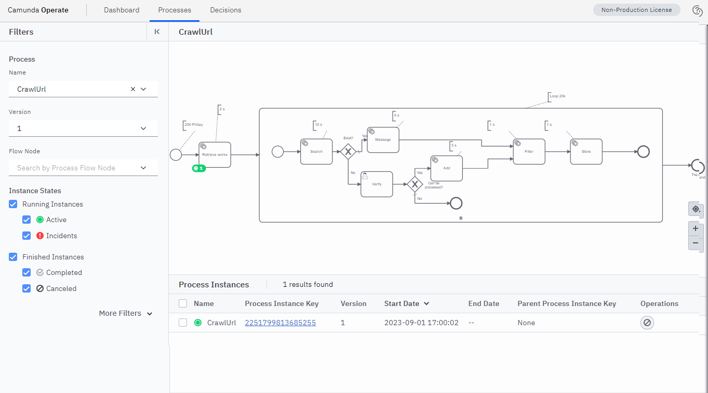
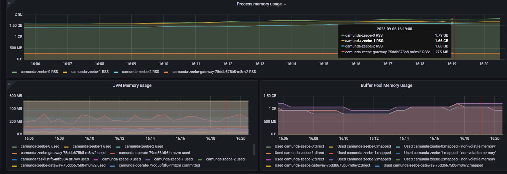
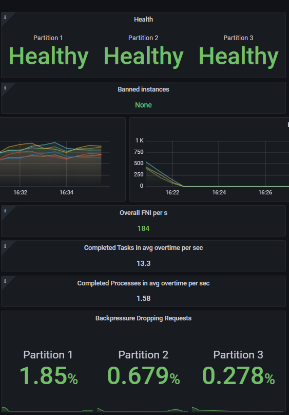

# Load Test Tutorial

The goal of this tutorial is to create a load test, execute it, check the metrics on Zeebe,
change the different parameters to find the correct configuration for the platform.

## Platform
A Zeebe cluster is mandatory to run the test. This cluster may be deployed locally, on a cloud, or
in the SaaS environment. The Grafana page is a plus for understanding how the Zeebe platform reacts.

The first step in the tutorial is to run the process automator locally.
The second part will run the Process-Automator inside a cluster, simulating workers and creating pods.

For the first step, a Zeebe Cluster is started, accessible from localhost:26000, and operates is
accessible on localhost:8081.

This Zeebe cluster runs 3 partitions and 3 replicas. The cluster size is 3

`````yaml
zeebe:
  clusterSize: 3
  partitionCount: 3
  replicationFactor: 3
  pvcSize: 5Gi
  env:
    - name: ZEEBE_BROKER_EXECUTION_METRICS_EXPORTER_ENABLED
      value: "true"
    - name: ZEEBE_BROKER_PROCESSING_MAXCOMMANDSINBATCH
      value: "5000"
  resources:
    requests:
      cpu: "1"
      memory: "512M"
    limits:
      cpu: "1"
      memory: "2Gi"

`````

## Specifications
Specifications are the following:


In this requirement, each service task needs some time to execute. The maximum time is provided in the comment.
The Search failed 10 % of the time, and a user must check the request. To be in the "load situation",
he will decide to process the URL.

200 orders must be processed every 30 seconds. An order contains multiple sub-searchs. This may vary from 10 to 20.

To check the peak, the test will consider the number of sub-search is 20.
The user task will be simulated to accept each request in less than 2 seconds.


This process is accessible in `doc/loadtestscenario/resources/C8CrawlUrl.bpmn`


## Deploy the process and check it

Deploy the process in your C8 server. Start a process instance with this information:

````json
{
  "loopSearch": [
    1,
    2,
    3,
    4,
    5
  ],
  "urlNotFound": true,
  "processAcceptable": true
}
````


Check via Operate. One process instance is created.



## The scenario

The scenario created is


**STARTEVENT**
Two types of Start event is created: one for the main flow (5 process instance per second) and the second one.
For the user task


````json
[
  {
    "type": "STARTEVENT",
    "taskId": "StartEvent",
    "processId": "CrawlUrl",
    "Frequency": "PT30S",
    "numberOfExecutions": "5",
    "nbWorkers": "1",
    "variables": {
      "urlNotFound": false
    },
    "variablesOperation": {
      "loopcrawl": "generaterandomlist(1000)"
    }
  },
  {
    "type": "STARTEVENT",
    "taskId": "StartEvent",
    "processId": "CrawlUrl",
    "Frequency": "PT1M",
    "numberOfExecutions": "1",
    "nbWorkers": "1",
    "variables": {
      "urlNotFound": true
    },
    "variablesOperation": {
      "loopcrawl": "generaterandomlist(1000)"
    }
  }
]

````

Then, one service task simulator per service task and one for the user task.

````json
[
  {
    "type": "SERVICETASK",
    "topic": "crawl-retrieve",
    "waitingTime": "PT2S",
    "modeExecution": "ASYNCHRONOUS"
  },
  {
    "type": "SERVICETASK",
    "topic": "crawl-search",
    "waitingTime": "PT10S",
    "modeExecution": "ASYNCHRONOUS"
  },
  {
    "type": "USER TASK",
    "taskId": "Activity_Verify",
    "waitingTime": "PT10S",
    "modeExecution": "ASYNCHRONOUS",
    "variables": {
      "processAcceptable": true
    }
  },
  {
    "type": "SERVICETASK",
    "topic": "crawl-add",
    "waitingTime": "PT5S",
    "modeExecution": "ASYNCHRONOUS"
  },
  {
    "type": "SERVICETASK",
    "topic": "crawl-message",
    "waitingTime": "PT0S",
    "modeExecution": "ASYNCHRONOUS"
  },
  {
    "type": "SERVICETASK",
    "topic": "crawl-filter",
    "waitingTime": "PT1S",
    "modeExecution": "ASYNCHRONOUS"
  },
  {
    "type": "SERVICETASK",
    "topic": "crawl-store",
    "waitingTime": "PT1S",
    "modeExecution": "ASYNCHRONOUS"
  }
]
````

## Run the scenario


### Via the CLI

The CLI tool starts one scenario and stops at the end of the execution. Because this is a Flow scenario,
It will begin with all the commands, and at the end of the test (specified in the duration time), check if
the objective has been fulfilled and then stopped.

To execute the scenario locally, use this command.

<todo how to find the correct Command line??>
````
cd target
java -cp *.jar org.camunda.automator.AutomatorCLI -s Camunda8Local -v -l MAIN -x run doc/loadtestscnario/resources/C8CrawlUrlScn.json
````

Camunda8Local is defined in the application.yaml file

````yaml

automator.servers:
  camunda8:
      name: "Camunda8Local"
      zeebeGatewayAddress: "127.0.0.1:26500"
      operateUserName: "demo"
      operateUserPassword: "demo"
      operateUrl: "http://localhost:8081"
      taskListUrl: ""
      workerExecutionThreads: 500
      workerMaxJobsActive2: 500
````


On Intellij, run this command


### Via the application

Specify in the application parameter what you want to run.

`````yaml
Automator.startup:
scenarioPath: ./doc/loadtestsscenario/resources
# List of scenarios separated by ;
scenarioAtStartup: C8CrawlUrlScn.json;
# DEBUG, INFO, MONITORING, MAIN, NOTHING
logLevel: MAIN
# string composed with DEPLOYPROCESS, WARMINGUP, CREATION, SERVICETASK (ex: "CREATION", "DEPLOYPROCESS|CREATION|SERVICETASK")
policyExecution: DEPLOYPROCESS|WARMINGUP|CREATION|SERVICETASK|USERTASK
`````


Run the command

````
mvn spring-boot:run
````

or via Intellij:


Note: The application will start the scenario automatically but will not stop.


### Run as a pod in the cluster

To be close to the final platform, let's run the process-automator not locally but as a pod in the cluster.

The main point is to provide the scenario to the pod.

1. Create a config map for the scenario
````
doc/loadtestscenario/
kubectl create configmap crawurlscnmap --from-file=resources/C8CrawlUrlScn.json 
````


2. Create a volume and mount the configMap in that volume
````yaml
      volumes:
        - name: scenario
          configMap:
            name: crawurlscnmap
````

3. Mount the volume in the container

`````yaml
volumeMounts:
  - name: scenario
    mountPath: C8CrawlUrlScn.json
    subPath: C8CrawlUrlScn.json
    readOnly: true
`````

4. Reference the file in parameters

`````
         -Dautomator.startup.scenarioResourceAtStartup=file:/C8CrawlUrlScn.json
`````

Then, deploy and start the docker image with
````
kubectl create -f ku-c8CrawlUrl.yaml
````


### Generate the Docker image again
An alternative consists of placing the scenario under `src/resources/` and building a new image.

Build the docker image via the build command. Replace `pierreyvesmonnet` with your docker user ID,

````
docker build -t pierreyvesmonnet/processautomator:1.0.0 .

docker push pierreyvesmonnet/processautomator:1.0.0
````


### Run with multiple pods

The idea is to deploy one pod per service task to be very close and simulate the same number of connections to Zeebe.

The pod that executes the task "search" must run only this worker. This is done
via parameters `policyExecution` and `filterService`

```
-Dautomator.startup.policyExecution=SERVICETASK
-Dautomator.startup.filterService=crawl-store
```


## Follow the progress

````log
o.c.a.engine.flow.RunScenarioFlows       : ------------ Log advancement at Tue Sep 05 17:16:21 PDT 2023 ----- 85 %, end in 59 s
o.c.a.engine.flow.RunScenarioFlows       : [STARTEVENT CrawlUrl-StartEvent-main#0] RUNNING  currentNbThreads[0] PI[{CrawlUrl=org.camunda.automator.engine.RunResult$RecordCreationPI@c94bd18}] delta[86]
o.c.a.engine.flow.RunScenarioFlows       : [STARTEVENT CrawlUrl-StartEvent-main#0] RUNNING  currentNbThreads[0] PI[{CrawlUrl=org.camunda.automator.engine.RunResult$RecordCreationPI@71fb8301}] delta[-85]
o.c.a.engine.flow.RunScenarioFlows       : [SERVICETASK crawl-retrieve-main#0] RUNNING  currentNbThreads[4] StepsExecuted[99] delta [5] StepsErrors[0]
o.c.a.engine.flow.RunScenarioFlows       : [SERVICETASK crawl-search-main#0] RUNNING  currentNbThreads[4] StepsExecuted[1939] delta [100] StepsErrors[0]
o.c.a.engine.flow.RunScenarioFlows       : [SERVICETASK crawl-add-main#0] RUNNING  currentNbThreads[4] StepsExecuted[0] delta [0] StepsErrors[0]
o.c.a.engine.flow.RunScenarioFlows       : [SERVICETASK crawl-message-main#0] RUNNING  currentNbThreads[4] StepsExecuted[1778] delta [100] StepsErrors[0]
o.c.a.engine.flow.RunScenarioFlows       : [SERVICETASK crawl-filter-main#0] RUNNING  currentNbThreads[4] StepsExecuted[1757] delta [99] StepsErrors[0]
o.c.a.engine.flow.RunScenarioFlows       : [SERVICETASK crawl-store-main#0] RUNNING  currentNbThreads[4] StepsExecuted[1777] delta [100] StepsErrors[0]
`````


## Check the result
Via the CLI or via the command line, the first execution is


Check the Grafana page, too, during the execution :


Looking at the result, it is visible that the "search" activity is the bottleneck.
To improve the performance, the number of worker

# Conduct a load test

## Theoretical calculation
The requirement is 200 process instances every 30 seconds. Let's base the calculation per minute.
This is then 400 process instances/minute.


The first task needs 2 seconds duration. To execute 400 process instances, it will need 2*400=800 s.
Because this throughput is required by minute, multiple workers must do it in parallel.
One worker has a throughput of 60 s per 60 s. Workers are mandatory to handle 800 s, 800/60=13.3 (so, 14).

This can be done in different ways:
* one application(pod) manage multiple threads. A worker with 14 threads is mandatory (one thread= one worker)
* or multiple applications(pods), with one thread, can be used (14 applications/pods)
* A mix of the two approaches is possible. The adjustment is made according to the resource.

If the treatment of the worker is to manage a movie, one pod can maybe deal with two or three workers at the same time.
So, to handle 14 workers, 14/3=5 pods may be necessary.

From the Zeebe client point of view, a pod can manage up to 200 threads after the multithreading is less efficient.

We are in a simulation in our scenario, so the only limit is about 200 threads per pod.

The theoretical calculation is

| Name          |  Duration(s) | Loop | Load (s) | Workers |
|---------------|-------------:|-----:|---------:|--------:|
| Retrieve Work |            2 |    1 |      800 |    13.3 |   
| Search        |           10 |   10 |    40000 |   666.7 |
| Message       |            1 |   10 |     4000 |    66.7 |
| Add           |            5 |   10 |    40000 |   333.3 |
| Filter        |            1 |   10 |     4000 |    66.7 |
| Store         |            1 |   10 |     4000 |    66.7 |


Regarding the number of tasks per second, 1+(10*4)=41 service tasks for a process instance.
Creating 200 Process Instances / 30 seconds means 200*2*41=16400 jobs/minute, **273 jobs/second**

Main metrics to monitor:

| Metric     |                             Goal |
|------------|---------------------------------:|
| Creation   |    6.66 process instances/second |
| Completion |    6.66 process instances/second |
| Task       |                  273 jobs/second |


## Context
The execution is processed in the cloud with the `ku-c8CrawlUrlMultiple.yaml`.
This deployment creates one pod per service task.

Each change:
* The change must be applied in the file
* The deployment must be run
````
kubectl create -f ku-c8CrawlUrlMultiple.yaml
````

Then, the cluster must be deleted.
`````
kubectl delete -f ku-c8CrawlUrlMultiple.yaml
`````

## Check the basic

During the load test, access the Grafana page.

**Throughput / process Instance creation per second**

This is the first indicator. Do you have enough process instances created per second?

In our example, the scenario creates 200 Process Instances / 30 seconds. The graph should move to 7 process instances per second.


**Throughput / process Instance completion per second**

This is the last indicator: if the scenario's objective consists of complete
process instances, it should move to the same level as the creation. Executing a process may need time,
so this graph should be symmetric but may start after.


**Job Creation per second**

Job creation and job completion are the second key factors. Creating process instances is generally not a big deal for Zeebe. Executing jobs (service tasks) is more challenging.
For example, in our example, for a process instance, there is 1+(10*4)=41 service tasks.
Creating 200 Process Instances / 30 seconds means 200*2*41=16400 jobs/minute, 273 jobs/second.


When the job completion is lower than the job creation, this is typical when a worker can handle the
throughput.


**CPU Usage**
CPU and Memory usage is part of the excellent health of the platform. Elasticsearch is, in general, the most consumer for the CPU.
If Zeebe is close to the value allocated, it's time to increase it or create new partitions.




**Gateway**

The gateway is the first actor for the worker. Each worker communicates to a gateway, which asks Zeebe's broker.
If the response time is terrible, increasing the number of gateways is the first option. However, the issue may come from the number of partitions: there may be insufficient partitions, and Zeebe needs time to process the request.


**GRPC**

GRPC graph is essential to see how the network is doing and if all the traffic gets a correct response time.
If the response is high, consider increasing the number of gateways or partitions.


**GRPC Jobs Latency**
Jobs latency is essential. This metric gives the time when a worker asks for a job or submits a job the time Zeebe considers the request. If the response is high, consider increasing the number of gateways or partitions.


**Partitions**
The number of partitions is a critical metric. If there is a lot of traffic, a lot of tasks
to be executed per second, then this is the first scale parameter.

Attention, too many partitions is counterproductive: a worker connects to the Zeebe Gateway to search
for a new job. The Zeebe Gateway will connect all partitions. When there are too many partitions (over 50), the delay in fetching further jobs increases.



**Partitions**

Zeebe maintains a stream to execute a process instance. In this stream, two pointers are running:
* one for the next job to execute (execute a gateway, execute a worker submission)
* one for the exporter to Elasticsearch

Where there is a lot of data to process, the Elasticsearch pointer may be late behind the execution:
The stream grows up. This may not be a big deal if, at one moment, the flow slows down, then the second pointer
will catch up. But if this is not the situation, the stream may reach the PVC limit. If this happens, then
the first pointer will slow down, and the Zeebe Engine will stop to accept new jobs: the speed will be then the slowest limit.

In the case of a high throughput test, it is nice to keep an eye on this indicator. If the positions differ a lot, you should enlarge the test period to check the performance when the stream is full because this
moment, the speed will slow down.


## first execution (Test 1)

As expected, the goal can't be reached with a 3 partitions cluster.

The creation is close to the result, but the goal failed.
````
 ERROR 1 --- [AutomatorSetup1] org.camunda.automator.engine.RunResult   :  Objective: FAIL Creation type CREATED processId [CrawlUrl] Objective Creation: ObjectiveCreation[4000] Created(zeebeAPI)[3912] Create(AutomatorRecor
d)[3884 (97 % ) CreateFail(AutomatorRecord)[1]
````

Looking at the Grafana overview, one partition gets a backpressure


Looking Operate, we can identify which service task was the bottleneck.


Attention: When the test is finished, you must stop the cluster as soon as possible. Because
Multiple pods are created to execute service tasks. If you don't stop these workers, they will continue to process

Note: To access this log after the creation, do a
````
kubectl get pods
````

Find the pod (due to the deployment, it got a prefix)`. Then run:
````
kubectl logs -f ku-processautomator-creation-679b6f64b5-vl69t
````


## Adjust workers (test 2)

**What's change**
To improve the platform, we adjust the worker on the expected value.

For example, for the worker `ku-processautomator-retrievework`, we moved the value to 15 (theory is 13.3).
````
                -Dautomator.servers.camunda8.workerExecutionThreads=15
````

For the Search, we move to 3 replicas, with several threads to 250

````
replicas: 3
                -Dautomator.servers.camunda8.workerExecutionThreads=250
````


** Execution**
During the execution, this log shows up
````
STARTEVENT Step #1-STARTEVENT CrawlUrl-StartEvent-CrawlUrl-01#0 Error at creation: [Can't create in process [CrawlUrl] :Expected to execute the comma
nd on one of the partitions, but all failed; there are no more partitions available to retry. Please try again. If the error persists contact your zeebe operator]
````
Looking at the Grafana overview, one partition gets a backpressure


The job latency is important to:


There are more workers now, putting more pressure on the engine.
The number of jobs per second is better now, close to 200.


The CPU is at 1 for Elasticsearch (which is the maximum limit in the cluster definition)
and 512 for Zeebe (the maximum limit too).


Note that Elasticsearch is not a bottleneck for Zeebe. To verify that, the "latest position exported" is compared to the
"latest position executed", and they are close.
But the issue will be in Operate: the dashboard may be late regarding the reality


The final result in Operate shows that it seems there is no major bottleneck


In the end, the creation objective is below.
````
Objective: FAIL Creation type CREATED processId [CrawlUrl] Objective Creation: ObjectiveCreation[4000] Created(zeebeAPI)[1235] Create(AutomatorRecor
````


The next move consists of increasing the number of partitions.

## Increase the platform (test 3)

**What's change**
A ten-partition platform is used. Elasticsearch will have 5 CPUs to run.
There is no change in the application cluster.

````yaml
zeebe:
  clusterSize: 10
  partitionCount: 10
  replicationFactor: 3

elasticsearch:
  replicas: 1
  resources:
    requests:
      cpu: "5"
      memory: "512Mi"
    limits:
      cpu: "5"
      memory: "2Gi"

`````


** Execution**

The execution went correctly.

The back pressure is very low


CPU stays at a normal level


Jobs Latency stays under a reasonable level.


Jobs per second can now reach 400 per second as a peak and then run at 300 per second. This level is stable.


At the end, Operate show that all process are mainly processed. Just some tasks are pending in 
a worker (this node stopped before the other, maybe)


Objectives are mainly reached: 3800 process instances were processed.

The reliqua comes from the startup of the different pods: the cluster starts different pods on the scenario.

````log
2023-09-07 19:10:53.400  INFO 1 --- [AutomatorSetup1] o.c.a.engine.flow.RunScenarioFlows       : Objective: SUCCESS type CREATED label [Creation} processId[CrawlUrl] reach 4010 (objective is 4000 ) analysis [Objective Creation: ObjectiveCreation[
4000] Created(zeebeAPI)[4010] Create(AutomatorRecord)[4010 (100 % ) CreateFail(AutomatorRecord)[0]}
2023-09-07 19:10:53.500 ERROR 1 --- [AutomatorSetup1] org.camunda.automator.engine.RunResult   :  Objective: FAIL Ended type ENDED processId [CrawlUrl] Fail: Ended : 4000 ended expected, 3800 created (95 %),
2
````

Note: The parameters for the Google Cloud are here [doc/loadtestscenario/test_3/camunda-values-2.yaml](test_3/camunda-values-2.yaml)

## Validate 10% more throughput (test 4)


To ensure the sizing is correct, we make a new test with more input
* Increase the warmup to 3 mn to pass the peak
* Increase the running time to 15 mn
* The number of process instances is set to 250 / 30 seconds (requirement is 200 / 30 seconds) - this is a 25% increase
* Increase the number of threads in each worker by 25 %

Load the new scenario
````
cd doc/loadtestscenario
kubectl create configmap crawurlscnmap250 --from-file=resources/C8CrawlUrlScn250.json 
````


The scenario used is `src/main/resources/loadtest/C8CrawlUrlScn250.json`

Jobs per second is stable.


and operate shows at the end of the test there is no bottleneck


The cluster can handle this extra overload. Objectives can be reach

````log
Objective: SUCCESS type CREATED label [Creation} processId[CrawlUrl] reach 7515 (objective is 4000
) analysis [Objective Creation: ObjectiveCreation[4000] Created(zeebeAPI)[7727] Create(AutomatorRecord)[7515 (187 % ) CreateFail(AutomatorRecord)[0]}
Objective: SUCCESS type ENDED label [Ended} processId[CrawlUrl] reach 7467 (objective is 4000 ) an
alysis [}
2
````

# Conclusion

Using the scenario and Process-Automator tool helps determine the platform's correct sizing.
Analysis tools (Grafana, Operate) are essential to qualify the platform.
