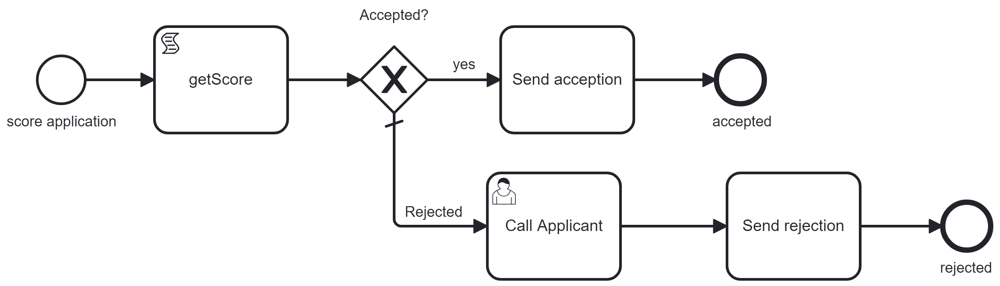

# Unit Scenario

## Goal
Verify a process reacts as expected.

There is multiple use case:
* When a process instance is created with the variable "amount>120", it follows the activity "getScore", and then "CheckUser"

* Verify that the performance is still the same and a service task stays under 300 ms to be executed

* Execute automatically multiple scenario to cover all the process.

* As a developer, you want to debug a service task in the process; You need to create a process instance and "advance it" in the process until you reach the activity


### Verification (path and performance)



in a CD/CI, you want to verify that a process follows the same behavior in the same performance
time. Running every day (or hours) or asking via an API call to replay a scenario is useful to
verify there is no difference. If the score is 200, do we still move the process instance to
Send Acceptation? 


### Advance process instances to a step for development

During the development, you debug the task "Send rejection". To test it in the situation, you
must have a process instance in the process and pass all user tasks. Each test takes time: when you
deploy a new process or want a new process instance, you need to execute again the different user
task. Using Automator with the correct scenario solves the issue. Deploy a new process, but instead
of starting from the beginning of a new process instance, start it via Automator. The scenario will
advance the process instance where you want it.


# Build a Scenario

A Unit scenario reference the different activity you need to simulate. If your environment has a worker behind the topic "getScore", you don't need to simulate it, so it must not be in the scenario?

In the unit scenario, you should place some Event (for example, the end event): the unit will verify that this event is registered in the history.

This verification implies to give an Operate access.

The scenario contain:

* The name, the process ID, 

* A list of flow to execute under attribut `executions`
* A list of verification under attribut `verifications`


## Scenario definition

Check the scenario:

[ScoreAcceptanceScn.json](resources/ScoreAcceptanceScn.json)

## execute

1. First, upload the scenario file in a config map

```
kubectl create configmap scoreacceptancescn --from-file=doc/unittestscenario/resources/scoreacceptancescn.json -n camunda
```

2. Deploy the scenario on the cluster, via the Modeler

3. Create the pod process-execution-automator

```
kubectl create -f doc/unittestscenario/resources/UnittestAutomator.yaml  -n camunda
```
This configuration will upload the scenario 


4. Port forward

```
kubectl port-forward svc/process-execution-automator 8381:8381 -n camunda
```

6. Check the scenario is uploaded

```
curl -X GET "http://localhost:8381/api/content/list" -H "Content-Type: application/json"
```


7. upload the scenario
```
curl -X POST -F "file=@/path/to/your/file.txt" http://localhost:8080/api/files/upload

curl -X GET "http://localhost:8381/api/unittest/get?id=1732767184446" -H "Content-Type: application/json"
```

