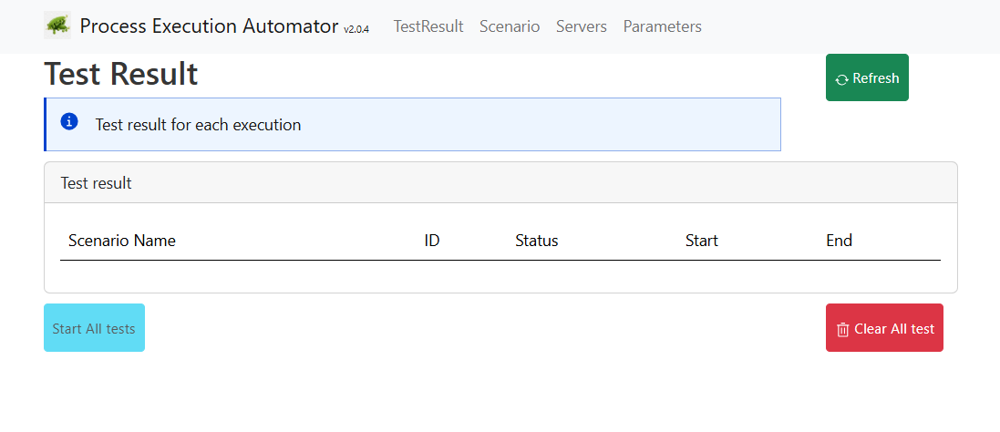

# Process Execution Automator

# Build the docker image

at root, use 
````yaml
docker build -t pierre-yves-monnet/process-execution-automator:2.1.0 .
````

The docker image is built using the Dockerfile present on the root level.


Push the image to the Camunda hub (you must be login first to the docker registry)

````
docker tag pierre-yves-monnet/process-execution-automator:2.1.0 ghcr.io/camunda-community-hub/process-execution-automator:latest
docker tag pierre-yves-monnet/process-execution-automator:2.1.0 ghcr.io/camunda-community-hub/process-execution-automator:2.1.0
docker push ghcr.io/camunda-community-hub/process-execution-automator:2.1.0
docker push ghcr.io/camunda-community-hub/process-execution-automator:latest
````


# Start it

````yaml
kubectl create -f pea.yaml -n camunda
````

A pod is started, and a service `pea-service` is available, under the port number `8381`


````shell
$ kubectl get svc
pea-service                         ClusterIP      34.118.237.219   <none>            8381/TCP                       4m35s
````
Use this port-forward command

````shell
kubectl port-forward svc/pea-service 8381:8381 -n camunda
````
Access localhost:8381



This kubernetes starts a load balancer with a public address.

````shell
kubectl create -f pea-public-loadbalancer.yaml -n camunda
````
Then get the public address

````shell
$ kubectl get svc
pea-public                        LoadBalancer   34.118.238.71    34.24.149.91   8381:30150/TCP                 46s
pea-service                       ClusterIP      34.118.238.219   <none>         8381/TCP                       5m7s
````

Then access http://34.24.149.91:8381